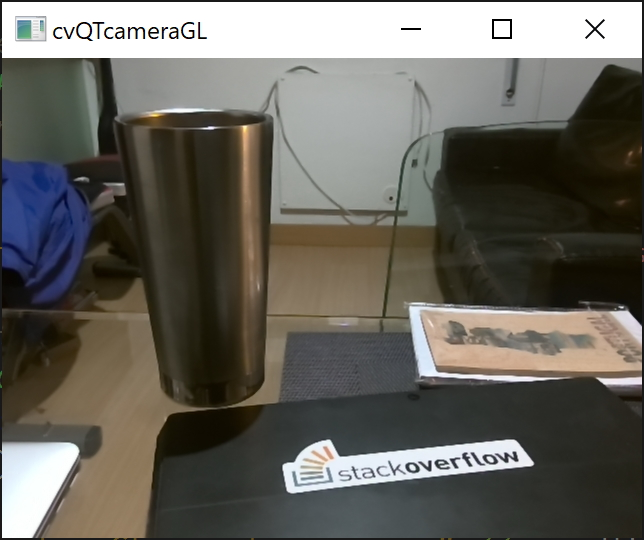

GraphicsProgramming
===================

Demos related to **OpenGL**, **Qt/QML**, **OpenCV** and other X technologies.

Demo                       | Description             	       | Screenshot    
----------------------------------|----------------------------------------|----------------------------------------
**cvDisplacementMapFilter** | C++ implementation of Displacement Map Filter in OpenCV that renders two images as a movie clip. |  
**cvFruitClassification** | C++/OpenCV port of [a cool Python application](http://github.com/eliezerb/FruitClassification) that performs Oranges vs Apples classification using LDA. |  
**cvImage** | C++/Qt/OpenCV example that displays an image and the RGB values of a pixel based on mouse coordinates. |  
**cvQTcameraGL** | Demonstrates how to use OpenCV to retrieve frames from the default camera and display them on Qt with native OpenGL. |  
**cvVideo** | Demonstrates how to use OpenCV/Qt to display video files with configurable Aspect Ratio. | 
**cvWatershedSegmentation** | [Stackoverflow example](https://stackoverflow.com/a/25851951/176769) that uses OpenCV's watershed segmentation with distance transform to segment beans. |  
**ipcQtGesture** | A Qt application that uses the old *Intel® Perceptual Computing SDK 2013* for gesture recognition. Windows only. | No image available
**qmlBattery** | A QML Battery element that displays the amount of energy left as horizontal bars according to the charge. On this demo, the charge is set dynamically and randomly from the C++ side. |  
**qtArduinoSerial** | An application that prints data from a serial (COM) port connected to an Arduino. | No image available
**qtFPSvsTIMEAnimation** | A Qt implementation of FPS-based and Time-based animation techniques, as explained by [Steven Lambert](http://blog.sklambert.com/using-time-based-animation-implement/) |  
**qtKinectVideo** | An application based on "Color Basics" from Kinect for Windows SDK 1.8. This demo shows how to display the Color Stream on your Qt application. | No image available
**qtLinearRegressionGD** | A C++/Eigen implementation of Linear Regression based on [Daniel Shiffman's tutorials](https://www.youtube.com/watch?v=szXbuO3bVRk). Data is plotted with [Madplotlib](https://github.com/madplotlib/madplotlib) |  
**qtLogoBlurGL** | A Qt/OpenGL demo that renders a logo on a texture and performs a blur for glow. |  
**qtSmoothColorTransition** | A Qt application that takes a grayscale image and performs a smooth color transition using a predefined color palette for linear interpolation. |  

