GraphicsProgramming
===================

Demos related to **OpenGL**, **Qt/QML**, **OpenCV** and other X technologies.

Demo                       | Description             	       | Screenshot    
----------------------------------|----------------------------------------|----------------------------------------
**cvDisplacementMapFilter** | Displacement Map Filter implementation in C++/OpenCV that renders two images as a movie clip. |  
**cvFruitClassification** | C++/OpenCV port of [a cool Python application](http://github.com/eliezerb/FruitClassification) that performs Oranges vs Apples classification using LDA. | 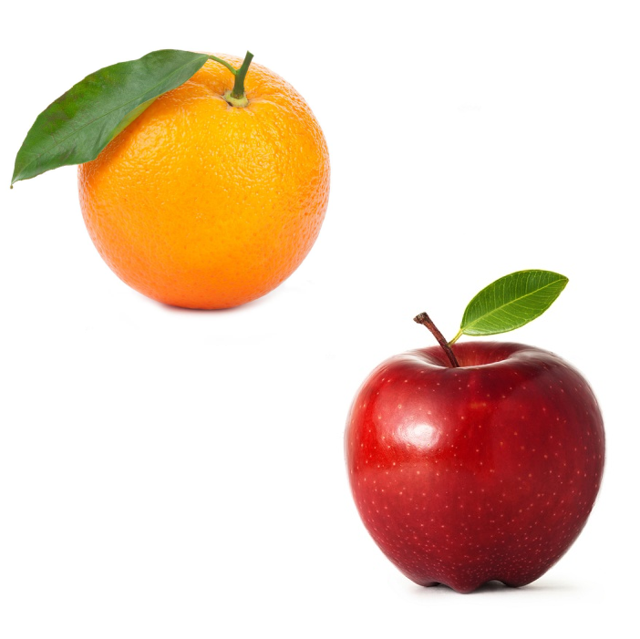 
**cvQtImage** | C++/OpenCV/Qt example that displays an image and the RGB values of a pixel based on mouse coordinates. | 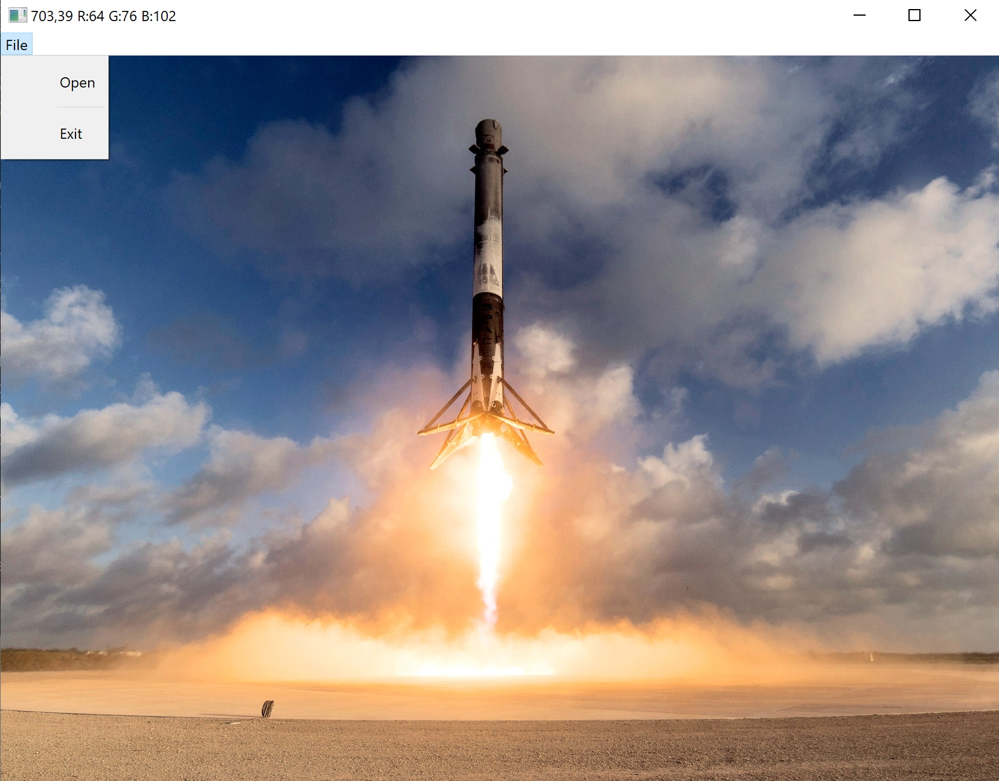 
**cvQtCameraGL** | An interesting demo that shows how to use C++/OpenCV to retrieve frames from the camera and draw them with Qt `QGLWidget` for GPU rendering (OpenGL). | 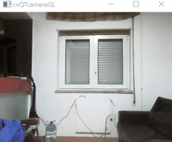 
**cvQtVideo** | Another C++/OpenCV/Qt example on how to display video files with configurable Aspect Ratio. | 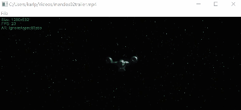 
**cvWatershedSegmentation** | [Stackoverflow answer](https://stackoverflow.com/a/25851951/176769) that uses C++/OpenCV's watershed segmentation with distance transform to segment beans. | 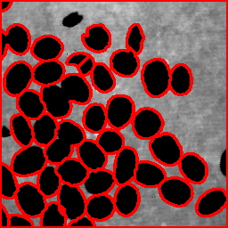 
**ipcQtGesture** | C++/Qt application that uses the old *Intel® Perceptual Computing SDK 2013* for gesture recognition. Windows only. | No image available
**qml2DRaycasting** | QML implementation of 2D raycasting. |  
**qml2DRaycastingEngine** | QML implementation of a 2D raycasting engine. | 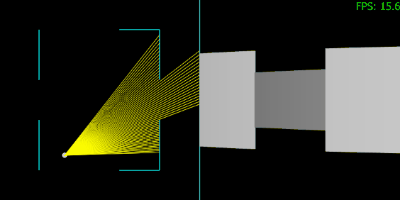 
**qml2DQuadTree** | QML implementation and visualization of the data structure *Quadtree* that offers operations to *insert* new points and *search* them within a rectangular area. | 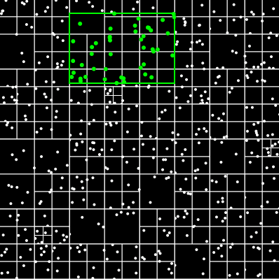 
**qml3DTerrain** | Qt3D/QML implementation of dynamic terrain generation based on Perlin noise. | 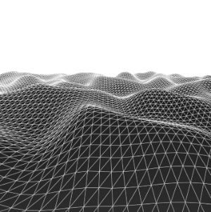 
**qml3DWater** | Qt3D/QML implementation of water reflection/refraction with Fresnel effect. |  
**qmlBattery** | A Qt/QML element that displays the amount of energy left in a Battery as horizontal bars according to the charge. For demonstration purposes, the charge value is set dynamically and randomly from the C++ side. | 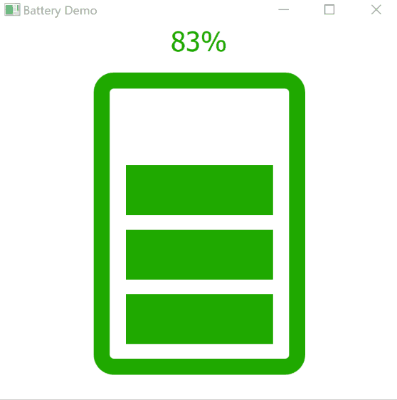 
**qt3DRenderer** | A complete 3D Graphics Renderer that demonstrates how to load simple meshes from Wavefront files (with texture) and performs all the required transformations to project them on a 2D color buffer that is copied into a `QImage` object to be displayed with Qt. | 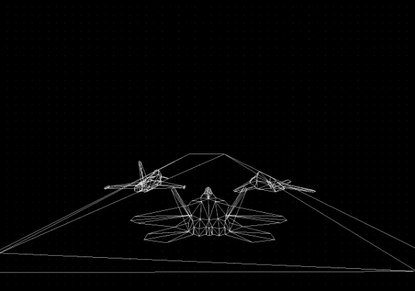 
**qtArduinoSerial** | A simple C++/Qt example on how to print data from a serial (COM) port connected to Arduino. | No image available
**qtFPSvsTIMEAnimation** | Super educational C++/Qt implementation of *FPS-based and Time-based animation techniques*, as explained by [Steven Lambert](http://blog.sklambert.com/using-time-based-animation-implement/). | 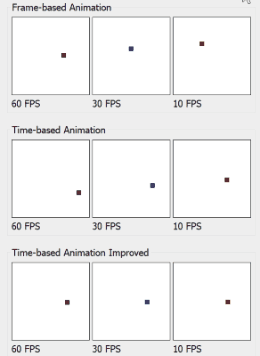 
**qtGLMdemo** | A customized `QGLWidget` that loads a 3D model from the disk using [Nate Robins GLM library](https://user.xmission.com/~nate/tutors.html) and renders it using native OpenGL calls. | 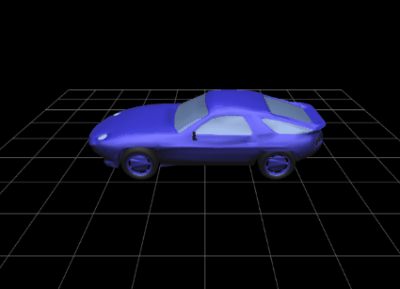 
**qtKinectVideo** | C++/Qt application based on *Color Basics* from Kinect for Windows SDK 1.8. This demo displays the Color Stream of the camera. | No image available
**qtLinearRegressionGD** | C++/Qt/Eigen implementation of Linear Regression based on [Daniel Shiffman's tutorials](https://www.youtube.com/watch?v=szXbuO3bVRk). Data is plotted with [Madplotlib](https://github.com/madplotlib/madplotlib) (Qt required). |  
**qtLogoBlurGL** | A silly C++/Qt/OpenGL demo that renders a logo on a texture and displays a glow around it. | 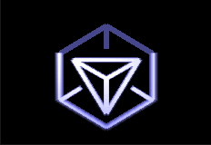 
**qtSmoothColorTransition** | A C++/Qt application that takes a grayscale image and performs a smooth color transition using a predefined color palette based on linear interpolation. | 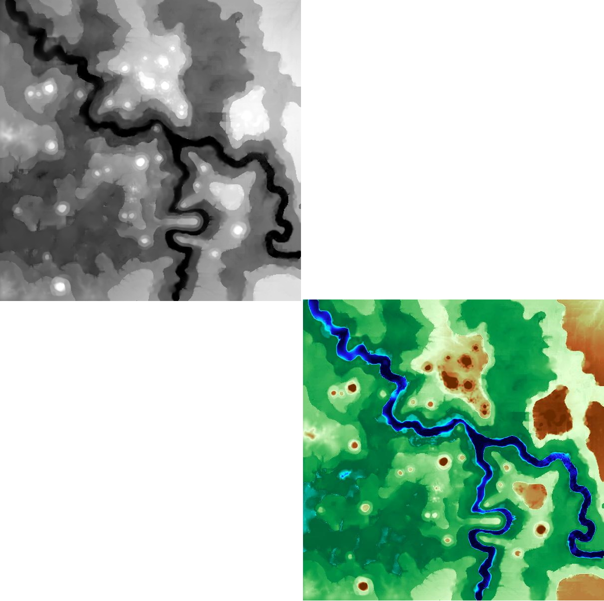
