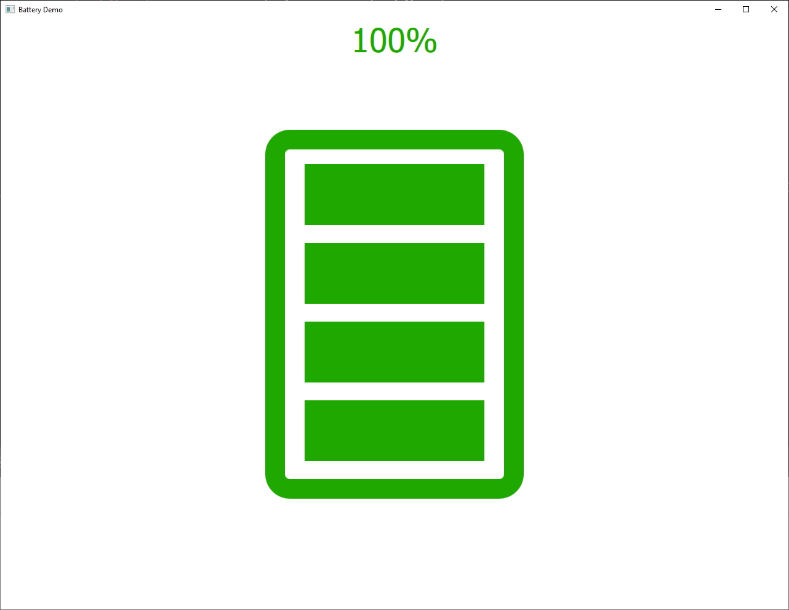

qmlBattery
===================
A battery widget designed in QML that displays the amount energy left as stacked bars according to the battery charge. 

On this demo, the charge is updated dynamically from the C++ side every 2 seconds.

Usage
--------------
```
Battery {
	id: batteryId
	charge: 100
	maxBars: 4
}  
```

Screenshot
--------------



