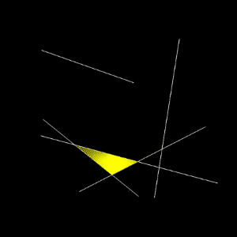

# qmlRayCasting2D

A naive implementation of 2D raycasting using line segment "surfaces" and vector "rays".

**Reference**: [The Coding Train - Coding Challenge #145: 2D Raycasting](https://www.youtube.com/watch?v=TOEi6T2mtHo)

